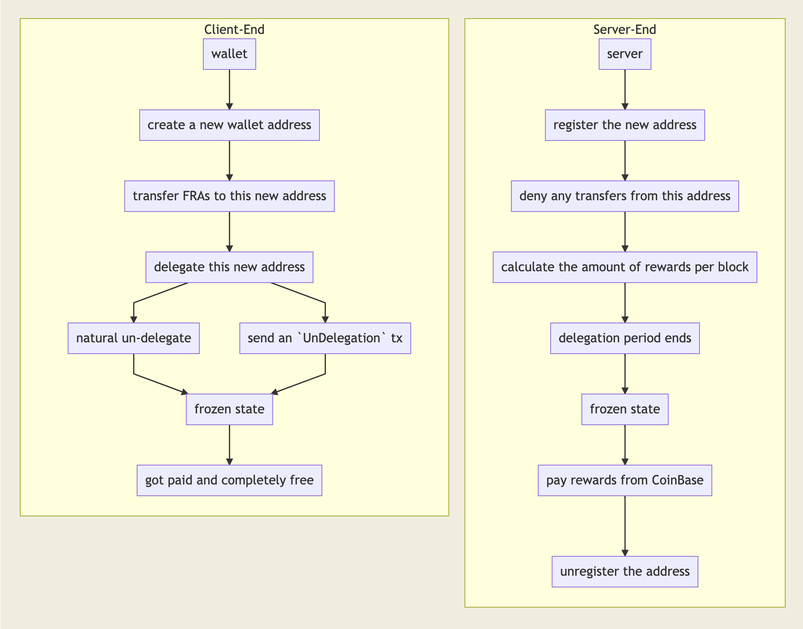
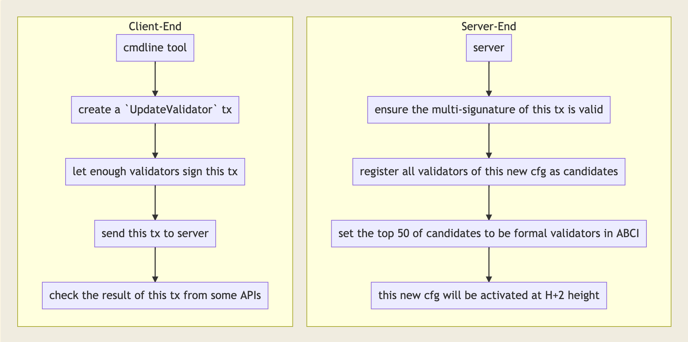
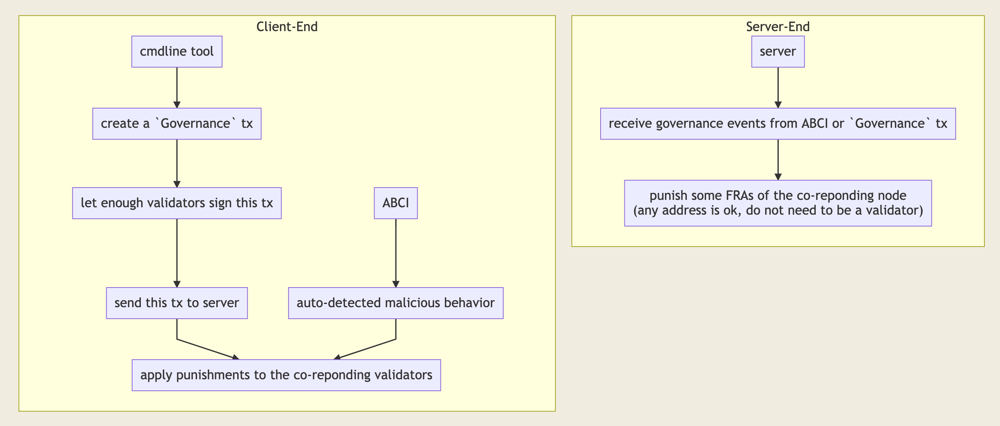
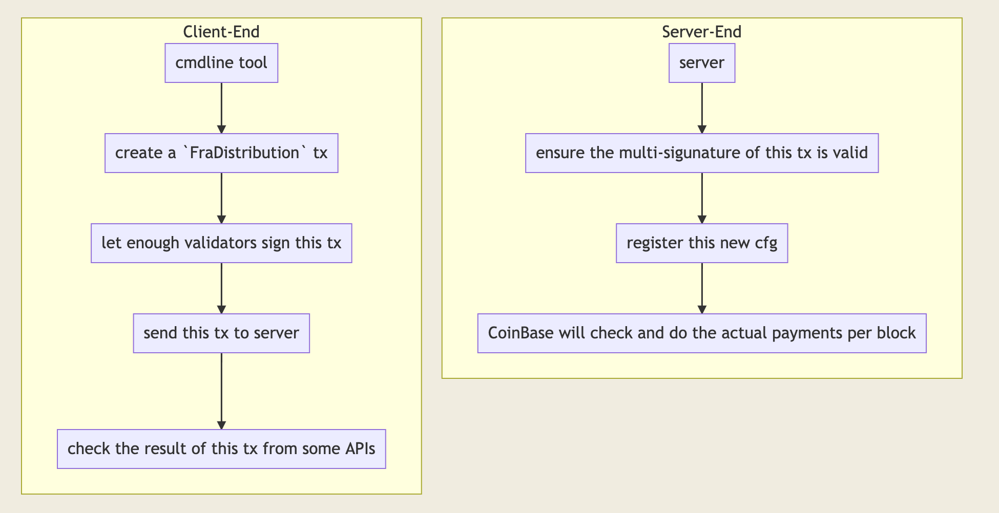
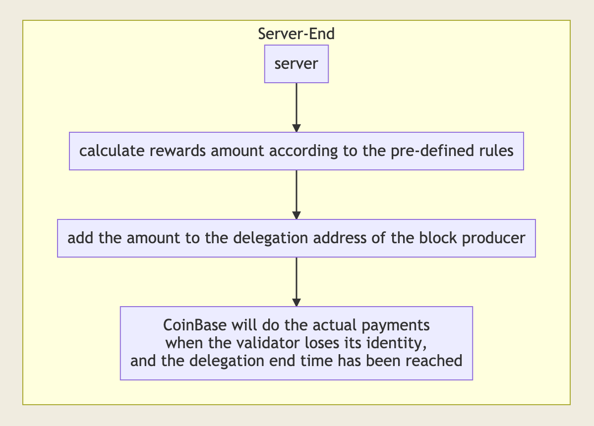

# Tendermint ABCI


## Logics of Staking

```
TendermintForwarder --> `if cfg!(feature = "abci_mock")` --> mpsc channel --> Tendermint Mocker --> ABCI Mocker
                    --> `else`                           --> p2p network  --> Tendermint Node   --> ABCI
```

#### Delegation && UnDelegation



- a delegated address can not send any assets to any addresses, but can receive any assets from other addresses, this state will continue until the `Frozen` state ends
- the increase in the voting weight of the target validator is exactly the same as the amount of delegation
- after the `Locked` state expires, the reduction in the voting weight of the target validator is exactly the same as the delegation amount
- if the balance in `CoinBase` is sufficient, the corresponding delegation rewards will be paid in the next block, and the amount is correct
- if the balance in `CoinBase` is insufficient, the corresponding delegation rewards can not be paid, and the delegation address contine to stay in the `Frozen` state, even if the `Frozen` deadline has expired
- when `CoinBase` gets new recharge, the corresponding rewards will be automatically paid, and the `Frozen` state will be lifted if it is not within the default `Frozen` period
- addresses in the validator list can never be released from the `Locked` state, such addresses must first exit the validator list
- a validator that has not finished self-delegation can not accept delegations from other addresses, and therefore can not increase its voting power

- a successful `UnDelegation` transaction will convert the state of a `Locked` delegation address to `Frozen`
- the corresponding delegation rewards will be calculated according to the actual end time, rather than the initial end time defined when the delegation is created
- the voting power of the corresponding validator will be reduced correctly

#### UpdateValidator



- a successful `UpdateValidator` transaction must reach the multi-signature threshold
    - in the initial state, there is no defined multi-signature rule, so an empty signature body is enough
    - we can define the initial validator collection through configuration file and environment variable
    - or! we must send a successful `UpdateValidator` transaction as soon as the staking function is launched to ensure the security of the network
- `UpdateValidator` transactions with less than 6 defined validators will be rejected

#### On-Chain Governance



- a successful `Governance` transaction must reach the multi-signature threshold
- a successful `Governance` transaction will trigger punishment for the target validator
- malicious nodes provided by ABCI will be directly punished

#### FRA Distribution



- a successful `FraDistribution` transaction must reach the multi-signature threshold
- a successful transaction will trigger the transfer of FRA from coinbase to the target address
- if the balance is insufficient, the payment will failed
- after recharging, it will be re-paid in the next block

#### Block Rewards

- the total amount meets the definition of the economic model
- only those addresses where the delegation target is the block producer can participate in the distribution of block rewards

#### Proposer Rewards



- the total amount meets the definition of the economic model
- these rewards belong entirely to the block producer

#### CoinBase About

- no fee is required for transfers from CoinBase

